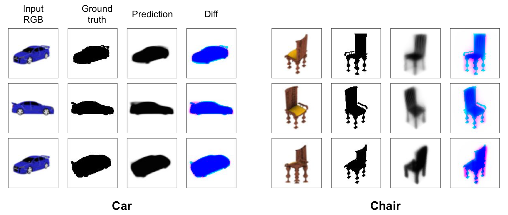

# Differentiable Ray Sampling for Neural 3D Representation 
This software is developed as a part of [Preferred Networks 2019 Research Internships](https://preferred.jp/en/news/internship2019/). <br> 
The main developer is [N. H. Shimada](http://ut25252.starfree.jp/).

The code realizes a differentiable renderer for neural 3D representation. The prediction model can be trained via only 2D images and conducts 3D reconstruction from a single RGB image (as below).<br>
For more details, please refer to [slides](https://~) and [blog (Japanese)](https://~).




## Pre-trained models

Please check out the [jupyter notebook 1](./DRS/Trained-car-all_instances-30000itr.ipynb) which shows the qualititive results using the trained models in the case of car class. 


## Training and Evaluating

There must be - 
- Creating the dataset of 10 rendered images of each car from ShapeNet V1 using blender. <br> 
(Please refer to the paper and codes of [Tulsiani+ CVPR 2017](https://github.com/shubhtuls/drc))

### Run the main code <br>
```python3 DRS/Main.py 0```  
to train networks and save them into DRS/save/. <br>

### Evaluating models <br>
- You can use [jupyter notebook 1](./DRS/Trained-car-all_instances-30000itr.ipynb) to represent the qualititive results of 3D reconstruction.
- [jupyter notebook 2](./IoU_evaluation/Mean_IoU/Car_all-30000itr.ipynb) will conduct calculation of mean voxel IoU for the test case.


## LICENSE
MIT License (see the [LICENSE](LICENSE) file for details).
